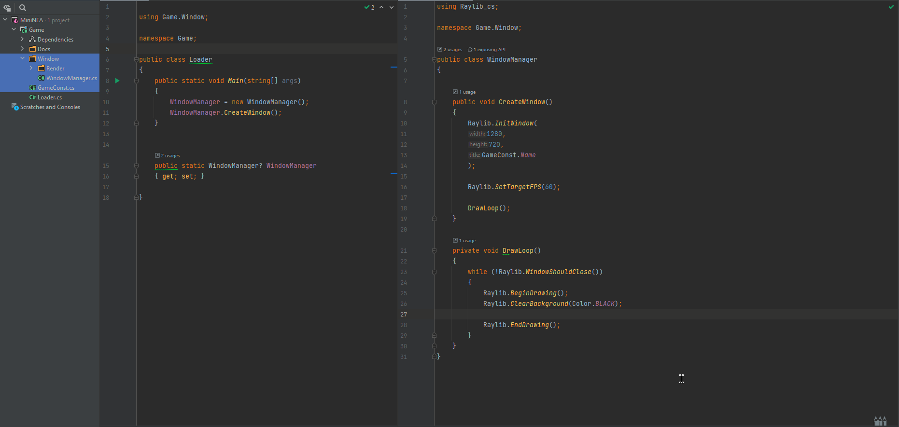

# MINI NEA

> ## Goals
> 
> - To create a 2D platform game
> - Answer questions to complete quests, to gain items, in order to complete the game
> - To incoperate information about computers into the game making it valuable to play, as it contains knolage

> ## Initial thoughs
> I want to create a 2D platform game, with the player being a 'Nano-helper', working in a PC building work shop, gathering, moving, or repairing various parts, and gaining knowledge to complete the challenges.
> I want the player to be controllable in the X and Y coordinates, and can move, grab, and pick up items, various controls and abilities being unlocked by hitting achievements and picking up items.
> I want the user to be able to learn about building or repairing computers, while playing a game.

> ## Analyse 
> The reason I want to create a 2D Q&A platform game, is because it can serve educational use, as it teaches about PC hardware, while also still being interesting to those already competent in the area.
> 

## Development

> ### Window Initialization
> 
> For my project, I will be using RayLib for C#.
> 
> Raylib requires some boilerplate to open a window and initialise it for drawing to the screen.
> The following code does just that, there is a `Loader.cs` which contains the main method and a `WindowManager.cs` that contains the window initialisation.
> 
> As you can see from the image above, I am going to be taking an object oriented approach to this project, so all game logic will be contained within classes. 

> ### Creating a render manager
> 
> Next im going to create a render class to handle the rendering of all the on screen elements separately from the other logic
> The following code in Renderer.cs is the basic code to handle element registration, and drawing to screen.
> 
> 