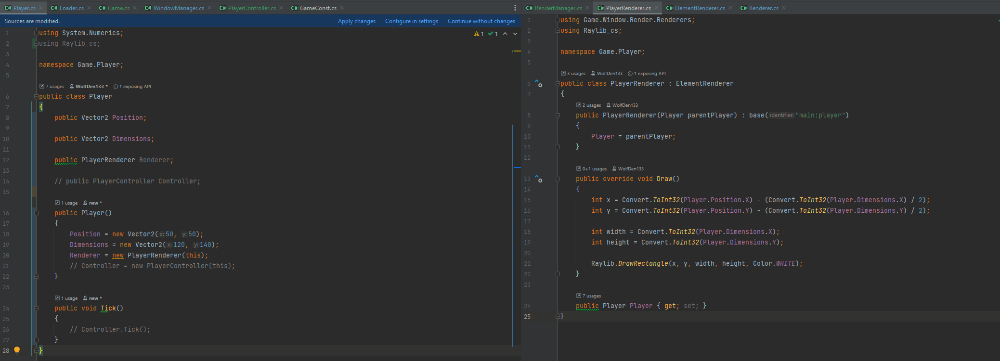
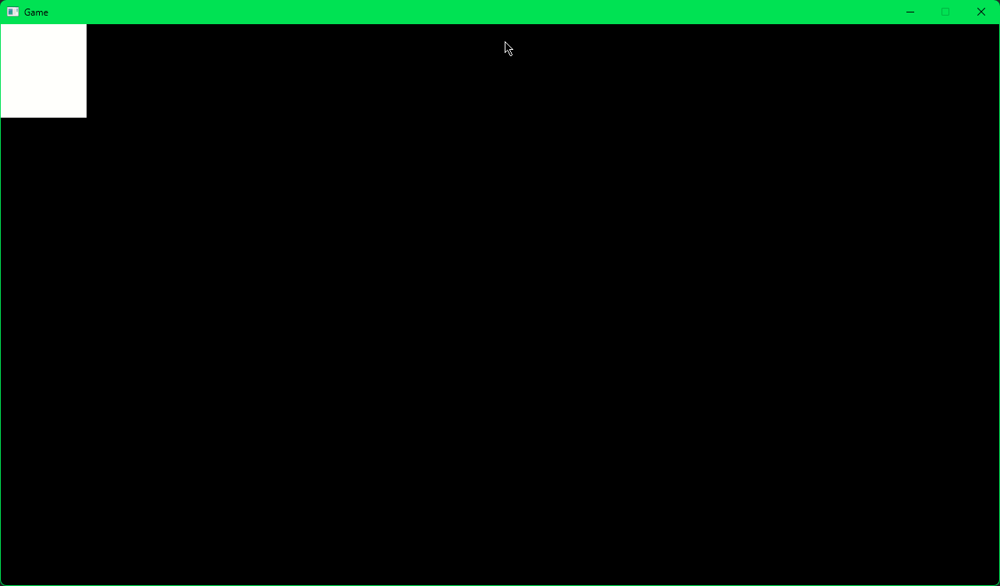

# MINI NEA

## Unnamed

Unnamed is a game with no name, its name is referenced no were, however don't overlook its simple design and graphics as under the hood, unnamed is an advanced machine only using User Inputs and Draw Functions as a structure, using custom made data structures, classes, managers, objects and much more to accomplish a fast and efficient design, while maintaining the ability of easily updating existing code, and even adding future elements.

## Analysis

> ## Goals
> 
> - To create a 2D platform game
> - To demonstrate advanced programming techniques to allow for future development
> - To use and expand knowledge to assist me in the development in this and future projects

> ### Initial thoughts
> I want to create a 2D platform game, with the player being a 'Nano-helper', working in a PC building work shop, gathering, moving, or repairing various parts, and gaining knowledge to complete the challenges.
> I want the player to be controllable in the X and Y coordinates, and can move, grab, and pick up items, various controls and abilities being unlocked by hitting achievements and picking up items.
> I want the user to be able to learn about building or repairing computers, while playing a game.

> ### Analysis and Problem Identification
> The reason I want to create a 2D Q&A platform game, is because it can serve educational use, as it teaches about PC hardware, while also still being interesting to those already competent in the area.
> I want the game to be able to be played by many, of all different ages and to help aid in the spread of knowledge about PCs.
> There are many people who love playing video games, but do not necessarily know the process of how that game is actually made, so this game should help people understand this subject better.

> ### Why a game?
> Well so many people play games all around the world every day on there computers, but how about while playing those games they could be learning about how the game starts as power, and ends in a controllable experience.
> Games are a good way to convey information as they can have you interact with elements, sometimes solving problems to teach a player a certain skill in there game.

> ### Other games like this
> 
> There have been some other games like what I want to create 
> > #### PC Building Simulator
> > This game provides the player with the experience of building a PC from scratch, I want to incorporate this mechanic in my game.
> > However this game is first-person 3D and is more of a story based or free building game, whereas my game will be a plat-former, puzzle game.
> 
> 
> > #### Mario
> > This game is a 2D side scroller, just like mine will be, the player executes movement based of of directional velocity, therefor I will be using these elements in my game.
> > However, Mario is a more traditional story-level stroke game, where you complete levels based on collecting items and clearing obstacles, but I want to have the player collecting items and bringing them back to a place.
> > Mario also has enemies, and my game currently does not.
> > 
## Development

> ### Notes
> - The reason that I gave everything its own renderers is so that you can easily find and replace how an element is drawn to the screen, therefor changing its appearance without having to change any logic, or having to look through loads of files.
> - The use of object bases and managers are for future-proofing as I intend to improve and update this project in future.
> - The use of creating a renderer is so that game logic and graphics can be completely separate, leading to tidier code, and improved maintainability; it is also good practice to keep these things separate.
> - The use of level files and a level database is so that it is easier to add levels to the game.
> - Comments have now been added, but were not when screenshots were taken. Look at source files for commenting.

> ### Window Initialization, RenderManager and Camera
> 
> For my project, I will be using RayLib for C#.
> 
> Raylib requires some boilerplate to open a window and initialise it for drawing to the screen.
> The following code does just that, there is a `Loader.cs` which contains the main method and a `WindowManager.cs` that contains the window initialisation.
> We register our camera for our scene in the WindowManager so we can control it in future code.
> 
> 
> 
> As you can see from the image above, I am going to be taking an object oriented approach to this project, so all game logic will be contained within classes.
> Next im going to create a render class' to handle the rendering of all the on screen elements separately from the other logic
> The following code in Renderer.cs is the basic code to handle element registration, and drawing to screen.
> 
> 
> 
> 
> 
> This gives us a basic framework for our main game to reference to draw things to the screen and manipulate the camera.
> Testing this part was as simple as hitting run, and watching. Our expected output would be a blank screen with nothing rendered inside, which I got.
> The camera was a later addition to this file as I needed a way for the screen to follow the player when they move around.
> This portion of the code can largely stay the same for the rest of the game.

> ### Game Main and GameRenderer
> I created a main file for the main game logic to be contained.
> 
> I also created a game render manager to send different elements to the main renderer.
> All of this is contained under Game namespace.
> The renderer will be our utility for quickly loading in elements of our scene and will be accessed through the game main.
> 
> 
> 
> The Main game file contains some basic logic for loading and clearing of levels, has dictionaries to store currently loaded data, and stores the main managers for on-screen game logic.
> 
> 
> 
> It also contains logic that will execute every frame. The following code will handle on-screen menus first and then if there is no menu active, will execute the camera control logic.
> 
> 
> 
> This gives us a place to start creating our elements of our game and a place to store our current game data.
> Testing this was easy as I used various `Console.WriteLine();` to check weather it was loaded correctly, luckily for me the only errors I got, referred to variable type declaration and were easy to fix.
> I think I would have preferred to put the camera control logic into its own file, so it can be controlled separately from the main game file, but this will do for now.
> Now we have our game foundation it will be easy to add elements.

> ### Creating the Player, PlayerRenderer and PlayerController
> Firstly, I created a player class, and added its own custom renderer.
> Then registered it in the main, the main then calls to the renderer for the player to be rendered.
> There is a small section of code to render a white rectangle, with the center being the players coordinates.
> This would make our player a sudo sprite as its coordinates are offset from its draw dimensions.
> 
> 
> 
> 
> Next I will be adding a player controller with included physics.
> Firstly, I created `PlayerController.cs` and initialised it inside `Player.cs`.
> Once I had done that, I then created a `Tick()` function inside the controller that will calculate the players positioning for each frame.
> Im going to be calculating player positions based off of velocities inside the controller file.
> 
> 
>
> Now we have a basic player object that is affected by gravity, we want this in our side-scroller plat-former.
> In future I would have put some more time into the player renderer, and maybe drawn in some textures for the player rather than a white square.
> Testing this was easy, as once the player renderer was registered to the main renderer, I could control an on-screen player left and right, while being affected by gravity.
> I did turn the players scale and forces down later in development when I needed more screen real-estate.
> Now we have a basic player, it gives our user a way to control my game, using the data held within the player, we can work out other things such as camera movements and collision detection.

> ### Floors and FloorRenderer + player collision detection
> 
> Next we will be creating a Floor file for something for our player to stand on.
> Inside our floor file we will define Position, Dimension, and its renderer
> 
> 
> 
> As you can see there is a function in our floor file to check if our player is near the bounds of the floor, that will provide use a way to calculate collision detection
> Inside the renderer it has a simple line of code to draw a rectangle for the floor bounds, giving us a visual way to see the floor.
> Once the game has registered the floor renderers they are drawn to the screen.
> 
> #### Player Collision
> 
> This part was one of the most hard parts of this project as it has a lot of calculations that have to pe perfect inorder for it to work.
> I went through many stages of development, finding many different bugs with the calculations, it took me just over a day to perfect this code 
> Inserting the code below implements Collision Detection for the Floors and Player
> ```csharp
>        float dimensionOffsetY = _parent.Dimensions.Y / 2;
>        float dimensionOffsetX = _parent.Dimensions.X / 2;
>        float footY = _parent.Position.Y + dimensionOffsetY;
>        
>        foreach (var pair in Loader.Game.Floors)
>        {
>            floor = pair.Value;
>            if (footY + ry > floor._position.Y && _parent.Position.X + dimensionOffsetX + rx >= floor._position.X && _parent.Position.X - dimensionOffsetX + rx <= floor._position.X + floor._dimensions.X) {
>                FloorBelow = floor;
>                break; 
>            }
>
>            FloorBelow = null;
>        }
>        
>        OnGround = false;
>
>        if (FloorBelow != null)
>        {
>            // Raylib.DrawText(Convert.ToString(FloorBelow._position.Y) + " " + Convert.ToString(footY), 0, 600, 24, Color.WHITE);
>            
>            
>            if (Convert.ToInt32(FloorBelow._position.Y) == Convert.ToInt32(footY))
>            {
>                OnGround = true;
>
>                if (!Raylib.IsKeyPressed(KeyboardKey.KEY_SPACE) && FloorC)
>               {
>                   _velocity.Y = 0;
>                   ry = 0;
>               }
>            } 
>            
>            else if (footY + ry >= FloorBelow._position.Y && footY <= FloorBelow._position.Y)
>            {
>                ry = (int)Math.Round(FloorBelow._position.Y - footY);
>            }
>
>            bool inYBounds = _parent.Position.Y + dimensionOffsetY > FloorBelow._position.Y && _parent.Position.Y - dimensionOffsetY < FloorBelow._position.Y + FloorBelow._dimensions.Y;
>            // On edge of platform
>            if (Convert.ToInt32(FloorBelow._position.X) == Convert.ToInt32(_parent.Position.X + dimensionOffsetX) ||
>                Convert.ToInt32(FloorBelow._position.X + FloorBelow._dimensions.X) == Convert.ToInt32(_parent.Position.X - dimensionOffsetX))
>            {
>                if (inYBounds)
>                {
>                    _velocity.X = 0;
>                    rx = 0;
>                }
>
>            }
>            
>            // Is player inside platform X bounds for the current X + rx, but not inside the platform for X
>            else if (((_parent.Position.X + dimensionOffsetX + rx >= FloorBelow._position.X &&
>                      _parent.Position.X + dimensionOffsetX <= FloorBelow._position.X) 
>                     ||
>                     (_parent.Position.X - dimensionOffsetX + rx <= FloorBelow._position.X + FloorBelow._dimensions.X &&
>                      _parent.Position.X - dimensionOffsetX >= FloorBelow._position.X + FloorBelow._dimensions.X))
>                     && inYBounds)
>            {
>                if (_parent.Position.X < FloorBelow._position.X + (FloorBelow._dimensions.X / 2)) rx = (int)Math.Round(FloorBelow._position.X - (_parent.Position.X + dimensionOffsetX));
>                else rx = (int)Math.Round((FloorBelow._position.X + FloorBelow._dimensions.X) - (_parent.Position.X - dimensionOffsetX));
>            }
>
>        }
> ```
> Explaining this in-depth would be too complicated so if your interested look at the logic.
> 
> I wish I had calculated the collision detection in a separate file so I could add it to future elements, so that will be a thing to improve on
> Testing this was a nightmare, as I said, it took me just under a day to debug and get this working, but eventually working it out was so satisfying.
> Now we have a way for the player to traverse the map

> ### MenuManager and Menus
> 
> The MenuManager provides a way to draw Menus like a level select or options screen to the game.
> In the manager there is some simple code to register all the menus and handle when and if there drawn to the screen
> The manager also calls the function inside the menus to execute there logic
> 
> 
> 
> 
> Using the menu class as a base we can create Menus and register them in the MenuManager
> Like in this example of the LevelMenu
> 
> 
> 
> 
> There are also menu elements in the Misc folder, that can draw and manager multiple different input methods.
> 
> 
>
> This provides a way for the user to navigate the game before they play it, customizing properties as they wish.
> Using this system we have a way to have menus in the game.

> ### Level, LevelManager and LevelMenu 
> 
> The Level and LevelManager classes serve as a way to store level data in an object, and the manager will control what level data should be given to the Game main to load.
> The Level class contains some basic logic to read the incoming data and store it in its variables
>
> 
> 
> 
> The LevelManager receives instructions and gives data to the LevelMenu, and manages the selection of a level to pass the data to be loaded in the Game main.
> It contains functions to load the levels contained in the level folder, and to error check them for loading, then adds it to the database of elements to be read by the LevelMenu.
> 
> 
> 
> The last part to make this complete is the LevelMenu
> The level menu handles input from the user, and handles its graphics using its render.
> 
> 
> 
> 
> Its renderer are passed any child elements and they are sent to render.
> Its renderer then draws the menu to the screen including all child elements.
> 
> 
> 
> And with this, we have a LevelMenu.
> 
> I would like to make this section of the code more streamlined and organised as I found that it can be a bit messy dealing with lots of different elements and properties can be challenging.
> Testing this, I created a template level file and then duplicated it for more levels, then added the levels to levels.json, and ran the program. The levels showed up and it was done.
> This provides the user to make a selection of what level they want to play_

## Evaluation 

> Firstly I would like to say that I am satisfied with the code as a whole, as I wanted to focus more on the actual game logic, to build a framework for creating objects that we can interact with and draw to the screen.
> However there is some things that I would like to improve on in this project.
> As the program stands, it currently remains in the Alpha stage, as the project is not currently finished to the extent of my initial thoughts and goals.


>### Alpha testing
> My first stage of alpha testing took place once I had completed Floor platforms and player collision.
> In the initial code I had, there were various bugs including:
> - Player not having collision with the floor
> - Player movement and velocity calculated after Move, therefor resulting in a frame where the player overshot the collision
> - Having collision for the whole length of the map, not just where it should
>
> With various tweaks to the code, and one full re-write of the collision detection. I eventually reached the solution I have, I was so relieved to find out that it worked correctly.
> Once I had completed the player collision I had the initial thought to move collision detection to a separate file, easier for implementing collision for other elements easier to implement, however, due to time constraints and the way the project was moving, it was clear that I needed to move on to something else.
> I may revisit this idea at a later date
> 
> The next stage of Alpha testing took place after Level loading was completed. 
> I simply loaded one level, and in the level manager defined level 1 as the default level to be loaded, before the LevelMenu was introduced.
> To my surprise this worked, with the only few bugs being related to json file reading.
> The reason for these errors was because, even though I knew how to read and write to files, I didn't know how to properly deserialize a json file in C#, so had some struggles with the learning curve.
> Once I got the hang of it, it worked a treat!

> ### Beta testing
> 
> As of now, I'm the only one who has beta tested my program, but everyone that I showed it to has had positive feedback to give.

